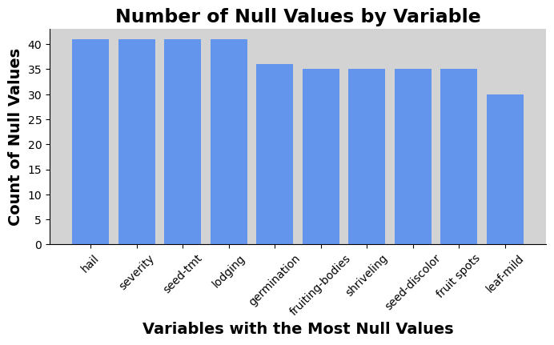
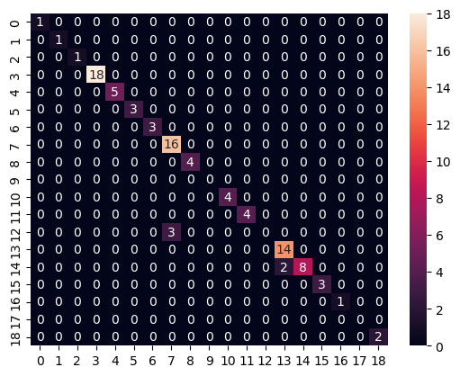

```python
import pandas as pd
import numpy as np
import matplotlib.pyplot as plt
from sklearn.model_selection import train_test_split as tts
from sklearn.linear_model import LogisticRegression
from sklearn import metrics
from sklearn.metrics import precision_recall_fscore_support as prf
from sklearn.metrics import precision_score
from sklearn.metrics import recall_score
from sklearn.ensemble import RandomForestClassifier as RFR
from sklearn.model_selection import GridSearchCV

import warnings
warnings.filterwarnings('ignore')
```

## Name of Target Classes (Pulled from Data Source) :

19 Classes:
diaporthe-stem-canker, charcoal-rot, rhizoctonia-root-rot,
phytophthora-rot, brown-stem-rot, powdery-mildew,
downy-mildew, brown-spot, bacterial-blight,
bacterial-pustule, purple-seed-stain, anthracnose,
phyllosticta-leaf-spot, alternarialeaf-spot,
frog-eye-leaf-spot, diaporthe-pod-&-stem-blight,
cyst-nematode, 2-4-d-injury, herbicide-injury.


## Key for Feature Encoding (Pulled from Data Source)
1. date: april,may,june,july,august,september,october,?.
2. plant-stand: normal,lt-normal,?.
3. precip: lt-norm,norm,gt-norm,?.
4. temp: lt-norm,norm,gt-norm,?.
5. hail: yes,no,?.
6. crop-hist: diff-lst-year,same-lst-yr,same-lst-two-yrs,
same-lst-sev-yrs,?.
7. area-damaged: scattered,low-areas,upper-areas,whole-field,?.
8. severity: minor,pot-severe,severe,?.
9. seed-tmt: none,fungicide,other,?.
10. germination: 90-100%,80-89%,lt-80%,?.
11. plant-growth: norm,abnorm,?.
12. leaves: norm,abnorm.
13. leafspots-halo: absent,yellow-halos,no-yellow-halos,?.
14. leafspots-marg: w-s-marg,no-w-s-marg,dna,?.
15. leafspot-size: lt-1/8,gt-1/8,dna,?.
16. leaf-shread: absent,present,?.
17. leaf-malf: absent,present,?.
18. leaf-mild: absent,upper-surf,lower-surf,?.
19. stem: norm,abnorm,?.
20. lodging: yes,no,?.
21. stem-cankers: absent,below-soil,above-soil,above-sec-nde,?.
22. canker-lesion: dna,brown,dk-brown-blk,tan,?.
23. fruiting-bodies: absent,present,?.
24. external decay: absent,firm-and-dry,watery,?.
25. mycelium: absent,present,?.
26. int-discolor: none,brown,black,?.
27. sclerotia: absent,present,?.
28. fruit-pods: norm,diseased,few-present,dna,?.
29. fruit spots: absent,colored,brown-w/blk-specks,distort,dna,?.
30. seed: norm,abnorm,?.
31. mold-growth: absent,present,?.
32. seed-discolor: absent,present,?.
33. seed-size: norm,lt-norm,?.
34. shriveling: absent,present,?.
35. roots: norm,rotted,galls-cysts,?.


```python
col_names = ['class','date','plant-stand','precip','temp','hail','crop-hist',
            'area-damaged','severity', 'seed-tmt','germination','plant-growth','leaves',
            'leafspots-halo','leafspots-marg','leafspots-size','leaf-shread',
            'leaf-malf','leaf-mild','stem','lodging','stem-cankers','canker-lesion',
            'fruiting-bodies','external decay','mycelium','int-discolor','sclerotia','fruit-pods',
             'fruit spots', 'seed','mold-growth','seed-discolor','seed-size', 'shriveling','roots']

df = pd.read_csv("soybean-large.data",names=col_names,na_values='?')
```


```python
df.shape
```


    (307, 36)


```python
df.head()
```


<div>
<style scoped>
    .dataframe tbody tr th:only-of-type {
        vertical-align: middle;
    }

    .dataframe tbody tr th {
        vertical-align: top;
    }

    .dataframe thead th {
        text-align: right;
    }
</style>
<table border="1" class="dataframe">
  <thead>
    <tr style="text-align: right;">
      <th></th>
      <th>class</th>
      <th>date</th>
      <th>plant-stand</th>
      <th>precip</th>
      <th>temp</th>
      <th>hail</th>
      <th>crop-hist</th>
      <th>area-damaged</th>
      <th>severity</th>
      <th>seed-tmt</th>
      <th>...</th>
      <th>int-discolor</th>
      <th>sclerotia</th>
      <th>fruit-pods</th>
      <th>fruit spots</th>
      <th>seed</th>
      <th>mold-growth</th>
      <th>seed-discolor</th>
      <th>seed-size</th>
      <th>shriveling</th>
      <th>roots</th>
    </tr>
  </thead>
  <tbody>
    <tr>
      <th>0</th>
      <td>diaporthe-stem-canker</td>
      <td>6.0</td>
      <td>0.0</td>
      <td>2.0</td>
      <td>1.0</td>
      <td>0.0</td>
      <td>1.0</td>
      <td>1.0</td>
      <td>1.0</td>
      <td>0.0</td>
      <td>...</td>
      <td>0.0</td>
      <td>0.0</td>
      <td>0.0</td>
      <td>4.0</td>
      <td>0.0</td>
      <td>0.0</td>
      <td>0.0</td>
      <td>0.0</td>
      <td>0.0</td>
      <td>0.0</td>
    </tr>
    <tr>
      <th>1</th>
      <td>diaporthe-stem-canker</td>
      <td>4.0</td>
      <td>0.0</td>
      <td>2.0</td>
      <td>1.0</td>
      <td>0.0</td>
      <td>2.0</td>
      <td>0.0</td>
      <td>2.0</td>
      <td>1.0</td>
      <td>...</td>
      <td>0.0</td>
      <td>0.0</td>
      <td>0.0</td>
      <td>4.0</td>
      <td>0.0</td>
      <td>0.0</td>
      <td>0.0</td>
      <td>0.0</td>
      <td>0.0</td>
      <td>0.0</td>
    </tr>
    <tr>
      <th>2</th>
      <td>diaporthe-stem-canker</td>
      <td>3.0</td>
      <td>0.0</td>
      <td>2.0</td>
      <td>1.0</td>
      <td>0.0</td>
      <td>1.0</td>
      <td>0.0</td>
      <td>2.0</td>
      <td>1.0</td>
      <td>...</td>
      <td>0.0</td>
      <td>0.0</td>
      <td>0.0</td>
      <td>4.0</td>
      <td>0.0</td>
      <td>0.0</td>
      <td>0.0</td>
      <td>0.0</td>
      <td>0.0</td>
      <td>0.0</td>
    </tr>
    <tr>
      <th>3</th>
      <td>diaporthe-stem-canker</td>
      <td>3.0</td>
      <td>0.0</td>
      <td>2.0</td>
      <td>1.0</td>
      <td>0.0</td>
      <td>1.0</td>
      <td>0.0</td>
      <td>2.0</td>
      <td>0.0</td>
      <td>...</td>
      <td>0.0</td>
      <td>0.0</td>
      <td>0.0</td>
      <td>4.0</td>
      <td>0.0</td>
      <td>0.0</td>
      <td>0.0</td>
      <td>0.0</td>
      <td>0.0</td>
      <td>0.0</td>
    </tr>
    <tr>
      <th>4</th>
      <td>diaporthe-stem-canker</td>
      <td>6.0</td>
      <td>0.0</td>
      <td>2.0</td>
      <td>1.0</td>
      <td>0.0</td>
      <td>2.0</td>
      <td>0.0</td>
      <td>1.0</td>
      <td>0.0</td>
      <td>...</td>
      <td>0.0</td>
      <td>0.0</td>
      <td>0.0</td>
      <td>4.0</td>
      <td>0.0</td>
      <td>0.0</td>
      <td>0.0</td>
      <td>0.0</td>
      <td>0.0</td>
      <td>0.0</td>
    </tr>
  </tbody>
</table>
<p>5 rows × 36 columns</p>
</div>


---------
# Null Values 
This section should be considered one of the more important ones because even small numbers of null values can create large biases within the data. Likewise, it is impractical to simply remove rows with null values here because we would lose an entire class and many rows out of this already small dataset.

```python
null_list = df.iloc[:,1:].isnull().sum().sort_values(ascending=False)[:(int(.3*len(df.columns)))]

plt.figure(figsize=(8,3.5)); ax = plt.gca()
plt.bar(list(null_list.index), height=null_list.values,color='cornflowerblue')
plt.xticks(ticks = null_list.index,rotation=45)
plt.ylabel('Count of Null Values',size = 14, fontweight='semibold')
plt.xlabel('Variables with the Most Null Values',size = 14, fontweight='semibold')
plt.title('Number of Null Values by Variable', size=17, fontweight='semibold')
ax.spines['top'].set_visible(False) 
ax.spines['right'].set_visible(False)
ax.set_facecolor('lightgrey')
```


    

    


```python
df.isnull().sum().sum()

```


    712


# Preparing Data for Model

It is important to use the mode to fill null values instead of the mean/median because the features are categorical. Likewise, some classes are ccompletely null for a given column, so we will use whole dataframe data for the mode.


```python
for name in col_names:
    df[name].fillna(df[name].mode()[0],inplace=True)
```


```python
df.head(1)
```


<div>
<style scoped>
    .dataframe tbody tr th:only-of-type {
        vertical-align: middle;
    }

    .dataframe tbody tr th {
        vertical-align: top;
    }

    .dataframe thead th {
        text-align: right;
    }
</style>
<table border="1" class="dataframe">
  <thead>
    <tr style="text-align: right;">
      <th></th>
      <th>class</th>
      <th>date</th>
      <th>plant-stand</th>
      <th>precip</th>
      <th>temp</th>
      <th>hail</th>
      <th>crop-hist</th>
      <th>area-damaged</th>
      <th>severity</th>
      <th>seed-tmt</th>
      <th>...</th>
      <th>int-discolor</th>
      <th>sclerotia</th>
      <th>fruit-pods</th>
      <th>fruit spots</th>
      <th>seed</th>
      <th>mold-growth</th>
      <th>seed-discolor</th>
      <th>seed-size</th>
      <th>shriveling</th>
      <th>roots</th>
    </tr>
  </thead>
  <tbody>
    <tr>
      <th>0</th>
      <td>diaporthe-stem-canker</td>
      <td>6.0</td>
      <td>0.0</td>
      <td>2.0</td>
      <td>1.0</td>
      <td>0.0</td>
      <td>1.0</td>
      <td>1.0</td>
      <td>1.0</td>
      <td>0.0</td>
      <td>...</td>
      <td>0.0</td>
      <td>0.0</td>
      <td>0.0</td>
      <td>4.0</td>
      <td>0.0</td>
      <td>0.0</td>
      <td>0.0</td>
      <td>0.0</td>
      <td>0.0</td>
      <td>0.0</td>
    </tr>
  </tbody>
</table>
<p>1 rows × 36 columns</p>
</div>


```python
df.isnull().sum().sum()
```


    0


Because there is at least one target class that only occurs once within our dataset, we cannot perform a stratified test train split.


```python
X = df.iloc[:,1:]
y = df.iloc[:,0]
```


```python
X.head(1)
```


<div>
<style scoped>
    .dataframe tbody tr th:only-of-type {
        vertical-align: middle;
    }

    .dataframe tbody tr th {
        vertical-align: top;
    }

    .dataframe thead th {
        text-align: right;
    }
</style>
<table border="1" class="dataframe">
  <thead>
    <tr style="text-align: right;">
      <th></th>
      <th>date</th>
      <th>plant-stand</th>
      <th>precip</th>
      <th>temp</th>
      <th>hail</th>
      <th>crop-hist</th>
      <th>area-damaged</th>
      <th>severity</th>
      <th>seed-tmt</th>
      <th>germination</th>
      <th>...</th>
      <th>int-discolor</th>
      <th>sclerotia</th>
      <th>fruit-pods</th>
      <th>fruit spots</th>
      <th>seed</th>
      <th>mold-growth</th>
      <th>seed-discolor</th>
      <th>seed-size</th>
      <th>shriveling</th>
      <th>roots</th>
    </tr>
  </thead>
  <tbody>
    <tr>
      <th>0</th>
      <td>6.0</td>
      <td>0.0</td>
      <td>2.0</td>
      <td>1.0</td>
      <td>0.0</td>
      <td>1.0</td>
      <td>1.0</td>
      <td>1.0</td>
      <td>0.0</td>
      <td>0.0</td>
      <td>...</td>
      <td>0.0</td>
      <td>0.0</td>
      <td>0.0</td>
      <td>4.0</td>
      <td>0.0</td>
      <td>0.0</td>
      <td>0.0</td>
      <td>0.0</td>
      <td>0.0</td>
      <td>0.0</td>
    </tr>
  </tbody>
</table>
<p>1 rows × 35 columns</p>
</div>


```python
# Let's say we want to split the data in 70:30 for train:valid:test dataset
train_size=0.8


# In the first step we will split the data in training and remaining dataset
X_train, X_test, y_train, y_test = tts(X,y, train_size=0.7,random_state=455)


print(X_train.shape), print(y_train.shape)
print(X_test.shape), print(y_test.shape)

```

    (214, 35)
    (214,)
    (93, 35)
    (93,)


    (None, None)


## Logistic Regression

The logistic regression is an appropriate tool here because of the nominal target variable. 


```python
pens = ['l1', 'l2']
solv = 'saga' #allows for more iterations, sake of testing
mc = 'multinomial'
```


```python
results = []
for pen in pens:
    lr = LogisticRegression(max_iter=100,random_state=455,penalty=pen,solver=solv,multi_class=mc)
    lr.fit(X_train, y_train)
    test_predictions = lr.predict(X_test)
    matches = y_test == test_predictions
    acc_score = matches.sum()/len(matches)
    results.append([pen,solv,mc,acc_score])

```


```python
results
```


    [['l1', 'saga', 'multinomial', 0.8709677419354839],
     ['l2', 'saga', 'multinomial', 0.946236559139785]]


```python

```

## Random Forest Classifier


```python
md = [3,9,13]
mss = [3,10,30]
ntree = [10,20,30]
```


```python
params = {
    'n_estimators' : ntree,
    'max_depth' : md,
    'min_samples_split' : mss
}

```


```python
rfr = RFR(random_state=455)
gs_rfr = GridSearchCV(rfr,
                      scoring='accuracy',
                      param_grid=params,
                      cv=5)
gs_rfr.fit(X_train, y_train)
gs_rfr.best_params_

```


    {'max_depth': 13, 'min_samples_split': 3, 'n_estimators': 30}


```python
rfr_bestfit = RFR(max_depth=13,min_samples_split=3,n_estimators=30)
rfr_bestfit.fit(X_train,y_train)

rfr_test_predictions = rfr_bestfit.predict(X_test)
rfr_matches = y_test == rfr_test_predictions
rfr_acc_score = rfr_matches.sum()/len(rfr_matches)
rfr_acc_score
```


    0.946236559139785


# Analyzing the accuracy
Because the best Random Forest performed equally to the best logistic regression, I chose to visualize the results of the random forest. The reason for the identical scoring relates to the small sample size with a lack of stratification, so some classes could not be accounted for. Going further, I would recommend not predicting that class, but for automation/industrialization, all data would


```python
label = list(df['class'].unique())
conf_mat = metrics.confusion_matrix(y_true=y_test, y_pred = rfr_test_predictions, labels=label)
#pd.DataFrame(conf_mat, columns= label,index=label)
```


```python
import seaborn as sns
sns.heatmap(conf_mat, annot=True)
```


    <Axes: >


    

    


https://scikit-learn.org/stable/modules/generated/sklearn.metrics.precision_score.html 
contains info on average 


```python
precision_score(y_test,rfr_test_predictions, average='micro')
```


    0.946236559139785


```python
recall_score(y_test,rfr_test_predictions, average='micro')
```


    0.946236559139785


## How do the different features inform our decisions? 


### Logistic Regression

Because the best logistic model we ran was the last one, we can just call the last logistic regression to be fit to the data. The logistic regression will have a different set of beta factors per class, meaning that different factors will have different influences on what will more likely lead to a given class. Because of this, I will repor back the most influetial factor for a given class and see if there are any telling important features. For the logistic regression, the most influential feature is the the feature with the highest magnitude.


```python
influences = pd.DataFrame(columns=['Class','MostInfluentialFeature'])
pred_classes = lr.classes_
betas = X.columns
for i in range(len(lr.coef_)):
    cur_class = pred_classes[i]
    cur_coefs = lr.coef_[i]
    temp_list = []
    for j in range(len(cur_coefs)):
        temp_list.append(abs(cur_coefs[j]))
    mostinf_position = np.argmax(temp_list)
    new_row = {'Class':cur_class, 'MostInfluentialFeature':betas[mostinf_position]}
    influences = influences.append(new_row,ignore_index=True)

```


```python
influences
```


<div>
<style scoped>
    .dataframe tbody tr th:only-of-type {
        vertical-align: middle;
    }

    .dataframe tbody tr th {
        vertical-align: top;
    }

    .dataframe thead th {
        text-align: right;
    }
</style>
<table border="1" class="dataframe">
  <thead>
    <tr style="text-align: right;">
      <th></th>
      <th>Class</th>
      <th>MostInfluentialFeature</th>
    </tr>
  </thead>
  <tbody>
    <tr>
      <th>0</th>
      <td>2-4-d-injury</td>
      <td>leafspots-halo</td>
    </tr>
    <tr>
      <th>1</th>
      <td>alternarialeaf-spot</td>
      <td>date</td>
    </tr>
    <tr>
      <th>2</th>
      <td>anthracnose</td>
      <td>stem-cankers</td>
    </tr>
    <tr>
      <th>3</th>
      <td>bacterial-blight</td>
      <td>leafspots-size</td>
    </tr>
    <tr>
      <th>4</th>
      <td>bacterial-pustule</td>
      <td>leafspots-size</td>
    </tr>
    <tr>
      <th>5</th>
      <td>brown-spot</td>
      <td>fruiting-bodies</td>
    </tr>
    <tr>
      <th>6</th>
      <td>brown-stem-rot</td>
      <td>precip</td>
    </tr>
    <tr>
      <th>7</th>
      <td>charcoal-rot</td>
      <td>int-discolor</td>
    </tr>
    <tr>
      <th>8</th>
      <td>cyst-nematode</td>
      <td>roots</td>
    </tr>
    <tr>
      <th>9</th>
      <td>diaporthe-pod-&amp;-stem-blight</td>
      <td>leaves</td>
    </tr>
    <tr>
      <th>10</th>
      <td>diaporthe-stem-canker</td>
      <td>fruit spots</td>
    </tr>
    <tr>
      <th>11</th>
      <td>downy-mildew</td>
      <td>leaf-mild</td>
    </tr>
    <tr>
      <th>12</th>
      <td>frog-eye-leaf-spot</td>
      <td>leaf-shread</td>
    </tr>
    <tr>
      <th>13</th>
      <td>herbicide-injury</td>
      <td>fruit-pods</td>
    </tr>
    <tr>
      <th>14</th>
      <td>phyllosticta-leaf-spot</td>
      <td>precip</td>
    </tr>
    <tr>
      <th>15</th>
      <td>phytophthora-rot</td>
      <td>canker-lesion</td>
    </tr>
    <tr>
      <th>16</th>
      <td>powdery-mildew</td>
      <td>leaf-mild</td>
    </tr>
    <tr>
      <th>17</th>
      <td>purple-seed-stain</td>
      <td>canker-lesion</td>
    </tr>
    <tr>
      <th>18</th>
      <td>rhizoctonia-root-rot</td>
      <td>fruit spots</td>
    </tr>
  </tbody>
</table>
</div>


```python
influences['MostInfluentialFeature'].value_counts()
```


    leafspots-size     2
    precip             2
    fruit spots        2
    leaf-mild          2
    canker-lesion      2
    leafspots-halo     1
    date               1
    stem-cankers       1
    fruiting-bodies    1
    int-discolor       1
    roots              1
    leaves             1
    leaf-shread        1
    fruit-pods         1
    Name: MostInfluentialFeature, dtype: int64


### Random Forest Classification

With the random forest classification, there is already a function built in to assess the most important feautres. This is decided by the amount of variance produced in the data set. Note, though, that features with a high covariances may both (or all) given lower feature importances.


```python
importances = rfr_bestfit.feature_importances_
rfr_feature_importances = pd.DataFrame({'Feature':X.columns,'Importances':importances})
```


```python
rfr_feature_importances.sort_values('Importances',ascending=False).head()
```


<div>
<style scoped>
    .dataframe tbody tr th:only-of-type {
        vertical-align: middle;
    }

    .dataframe tbody tr th {
        vertical-align: top;
    }

    .dataframe thead th {
        text-align: right;
    }
</style>
<table border="1" class="dataframe">
  <thead>
    <tr style="text-align: right;">
      <th></th>
      <th>Feature</th>
      <th>Importances</th>
    </tr>
  </thead>
  <tbody>
    <tr>
      <th>0</th>
      <td>date</td>
      <td>0.085445</td>
    </tr>
    <tr>
      <th>21</th>
      <td>canker-lesion</td>
      <td>0.072391</td>
    </tr>
    <tr>
      <th>28</th>
      <td>fruit spots</td>
      <td>0.054547</td>
    </tr>
    <tr>
      <th>14</th>
      <td>leafspots-size</td>
      <td>0.051665</td>
    </tr>
    <tr>
      <th>20</th>
      <td>stem-cankers</td>
      <td>0.046211</td>
    </tr>
  </tbody>
</table>
</div>


## What did we learn?
Both the logistic regression and the random forest found top importances to precipitation and leafspot-size. The most importance features in the rand forest was the most important feature to at least one class using the logistic regression. The biggest difference is that the random forest find the overall importance where as the methodolgy for the logistic regression was more adhoc. 

In the end, I would choose the random forest classification because it can be visually explainable and comprehensible for business owners. Likewise, it potentially better accounts for biases because of the ensemble methodologies. 

In the end, more data is required in order to perform stratified sampling for the testing and training data. I hypothesis this would increase both models in overall accuracy.


```python

```
